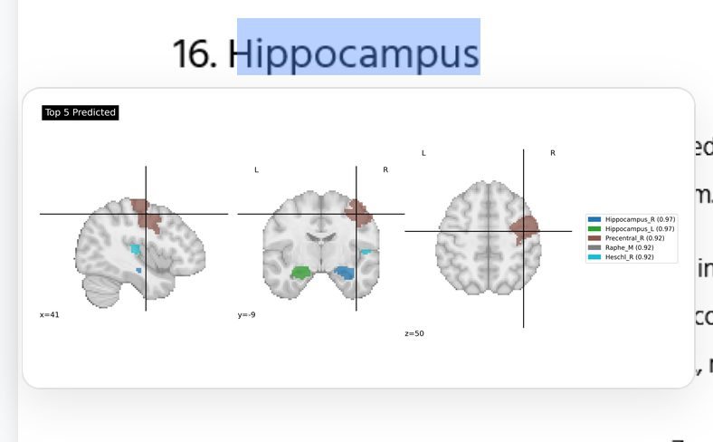

# Brain Visualisation
Based on finetuned BioBERT, for visualising different brain regions from text description.

Different NLP approaches are stored in the `helpers/experiments` directory.

Setup to run the full visualisation (Node.js, conda/mamba required, cuda for faster execution)
1. Clone or download the project.
2. Start with this command in the root directory.
   ```python
   npm install
   ```
   This will install the necessary libraries, depending on the existing version of node installed some errors need to be resoled.
3. Create `local.config.json` based on `template_local.config.json`. This defines which model will be used to predict the brain regions. Update `config.json` if the typically used `localhost:3000` is not available.
4. Create conda env for running the model. 
   ```python
   conda env create -f environment.yml
   ```
5. Start the server with visualisations.
   ```python
   npm start
   ```
   This will start the visualisation server at `http://localhost:3000` in your browser.

The available functionalities are listed below.
- [x] Uploading pdf/html file.
- [x] Opening the file in a browser.
- [x] Highlighting the text connects to the model, that read the text, and generates the image. The image is also saved in the `output` directory.

# Data
The uploaded data includes the following elements.
* `train` folder with the dataset used to train the model
* `test` folder with the dataset used to test the model
* `validation` dataset folder with the dataset used to validate the model
* AAL3v1 files (`.nii|.txt`) with the data extracted from the AAL brain atlas
* AAL3v1 structured dictionary (`AAL3v1.json`) with the data extracted from the AAL brain atlas
* AAL dictionary from the relevant paper (`paper_ALL3.json`) with the data extracted from the AAL brain atlas
* Uberon anatomy ontology, filtered for brain entities (`brain-view.json`)
* Structured Uberon brain regions with names and definitions (`brain_uberon_structured.json`)
* Downloaded PubMED abstracts (`abstracts.csv`)
* Annotated PubMED abstracts, with either *B-Brain* or *O* annotations (`annotated_abstracts.csv`)
* Annotated brain regions connl file for NER finetuning with either *B-Brain* or *O* annotations (`annotated_brain_regions.connl`)

# Data preprocessing
The main question is what brain regions should be used for text extraction and later visualisation. There are the major parts (cerebrum, brainstem, cerebellum), lobes (frontal, temporal, parietal, occipital), individual structures (hippocampus, amygdala). Each region can be subdivided into smaller parts, there are different networks (DMN) and systems.

Each atlas for visualisations has a different naming system and split, with AAL3v1 and schaeffer being the most commonly used for brain regions. Most of the experiments in the repository have focues on either structures of the brain or aal atlas regions.

During the data preprocessing part, new dictionaries and connections were generated, and stored in the data folder.
# Experiments
The `helper\experiments` folder contains Jupyter notebooks with experiments and different approaches to the given problem.
## `brain_text_detection.ipynb`: the simplest approach
## `ner_tutorial.ipynb` based on medical NER tutorial
The brain regions used in the notebook are the most common ones, they do not come from any atlas or dictionary. First, the model was trained to recognize whether the text is brain related or not, based on PubMED abstracts fetched for the list of regions.
<table>
 <tr style="text-align: left;">
      <th>Epoch</th>
      <th>Training Loss</th>
      <th>Validation Loss</th>
      <th>Precision</th>
      <th>Recall</th>
      <th>F1</th>
    </tr>
  </thead>
  <tbody>
    <tr>
      <td>1</td>
      <td>No log</td>
      <td>0.282965</td>
      <td>0.201717</td>
      <td>0.256831</td>
      <td>0.225962</td>
    </tr>
    <tr>
      <td>2</td>
      <td>No log</td>
      <td>0.154976</td>
      <td>0.426724</td>
      <td>0.540984</td>
      <td>0.477108</td>
    </tr>
    <tr>
      <td>3</td>
      <td>No log</td>
      <td>0.122615</td>
      <td>0.542373</td>
      <td>0.699454</td>
      <td>0.610979</td>
    </tr>
    <tr>
      <td>4</td>
      <td>No log</td>
      <td>0.100538</td>
      <td>0.666667</td>
      <td>0.765027</td>
      <td>0.712468</td>
    </tr>
    <tr>
      <td>5</td>
      <td>No log</td>
      <td>0.095848</td>
      <td>0.669725</td>
      <td>0.797814</td>
      <td>0.728180</td>
    </tr>
  </tbody>
</table>

## `brain2qwerty` and how it connects with hierarchy of brain regions

# Final Models
Normally the embeddings and safetensors would not be uploaded, and ignored, but they were uploaded using LFS for convenience.
   
# Results
The simple version of biobert, with embeddings based on AAL3v1 regions of the brain but with no extra pre-training works well only when the text is closely related to the name of the region. The probability of each region is listed in the brackets. 


The more complex version of biobert, trained on annotated PubMed abstracts. The dictionary comes from the AAL3v1 atlas with 170 unique brain regions.

The most complex model was trained on hierarchical embeddings. AAL atlas has brain regions that are extremely common (hippocampus) and others that are quite rare. The goal is to highlight the most relevant regions.

# References
1. Medium NER tutorial [link](https://medium.com/@maneyogesh065/fine-tuning-biobert-for-custom-named-entity-recognition-a-complete-guide-a05b124edda0)
2. BioBERT-CRF paper [link](https://onlinelibrary.wiley.com/doi/full/10.15302/J-QB-022-0302)
3. How to choose tools for unique BioNER need [link](https://www.sciencedirect.com/org/science/article/pii/S1874120724000031)
4. BioSERPBERT repository of neuroscience representation of brain region text mining [link](https://github.com/Brainsmatics/BioSEPBERT)
5. Connectivity search engine with different connected embeddings [link](http://atlas.brainsmatics.org/res/BioSEPBERT/)
6. Data fetching tutorial [link](https://biopython.org/docs/dev/Tutorial/chapter_entrez.html)
7. Token classification [link](https://huggingface.co/learn/llm-course/chapter7/2)
8. Brain2Qwerty [link](https://github.com/facebookresearch/brain2qwerty)
9. Noninvasive decoding of typed sentences from human brain activity [link](https://www.nature.com/articles/s41593-026-02303-2)